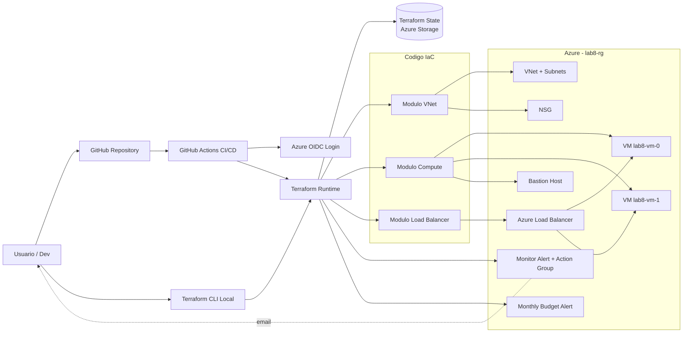

# Diagrama De Componentes - Caso De Estudio

```mermaid
flowchart LR
  U[Usuario / Dev] --> GH[GitHub Repository]
  U --> TFCLI[Terraform CLI Local]

  GH --> GHA[GitHub Actions CI/CD]
  GHA --> OIDC[Azure OIDC Login]
  GHA --> TF[Terraform Runtime]

  TFCLI --> TF
  TF --> STATE[(Terraform State<br/>Azure Storage)]

  subgraph CODE[Codigo IaC]
    M1[Modulo VNet]
    M2[Modulo Compute]
    M3[Modulo Load Balancer]
  end

  TF --> M1
  TF --> M2
  TF --> M3

  subgraph AZ[Azure - lab8-rg]
    VNET[VNet + Subnets]
    NSG[NSG]
    LB[Azure Load Balancer]
    VM0[VM lab8-vm-0]
    VM1[VM lab8-vm-1]
    BAS[Bastion Host]
    MON[Monitor Alert + Action Group]
    BUD[Monthly Budget Alert]
  end

  M1 --> VNET
  M1 --> NSG
  M2 --> VM0
  M2 --> VM1
  M2 --> BAS
  M3 --> LB

  LB --> VM0
  LB --> VM1

  TF --> MON
  TF --> BUD
  MON -. email .-> U
```
