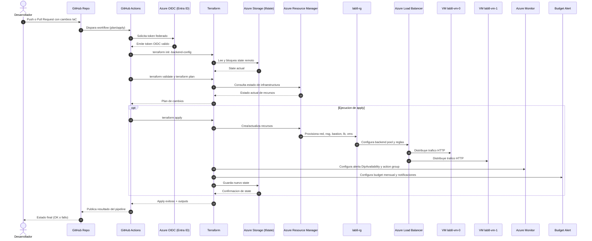

# Diagrama De Secuencia - Caso De Estudio

```mermaid
sequenceDiagram
  autonumber
  actor Dev as Desarrollador
  participant GH as GitHub Repo
  participant GHA as GitHub Actions
  participant OIDC as Azure OIDC (Entra ID)
  participant TF as Terraform
  participant ST as Azure Storage (tfstate)
  participant AZ as Azure Resource Manager
  participant RG as lab8-rg
  participant LB as Azure Load Balancer
  participant VM0 as VM lab8-vm-0
  participant VM1 as VM lab8-vm-1
  participant MON as Azure Monitor
  participant BUD as Budget Alert

  Dev->>GH: Push o Pull Request con cambios IaC
  GH->>GHA: Dispara workflow (plan/apply)

  GHA->>OIDC: Solicita token federado
  OIDC-->>GHA: Emite token OIDC valido

  GHA->>TF: terraform init -backend-config
  TF->>ST: Lee y bloquea state remoto
  ST-->>TF: State actual

  GHA->>TF: terraform validate y terraform plan
  TF->>AZ: Consulta estado de infraestructura
  AZ-->>TF: Estado actual de recursos
  TF-->>GHA: Plan de cambios

  opt Ejecucion de apply
    GHA->>TF: terraform apply
    TF->>AZ: Crea/actualiza recursos
    AZ->>RG: Provisiona red, nsg, bastion, lb, vms
    RG->>LB: Configura backend pool y reglas
    LB->>VM0: Distribuye trafico HTTP
    LB->>VM1: Distribuye trafico HTTP
    TF->>MON: Configura alerta DipAvailability y action group
    TF->>BUD: Configura budget mensual y notificaciones
    TF->>ST: Guarda nuevo state
    ST-->>TF: Confirmacion de state
  end

  TF-->>GHA: Apply exitoso + outputs
  GHA-->>GH: Publica resultado del pipeline
  GH-->>Dev: Estado final (OK o fallo)
```
