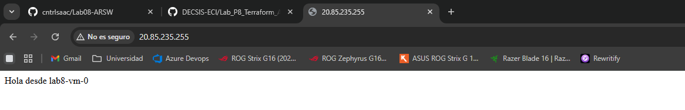
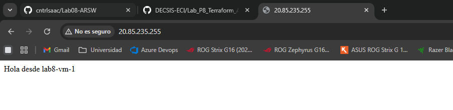

# Evidencia De Desarrollo - Lab 8 Terraform En Azure

## Resumen
En este laboratorio desplegamos infraestructura en Azure con Terraform de extremo a extremo: backend remoto para el state, red, NSG, load balancer y dos VMs Linux. También configuramos CI/CD con GitHub Actions y autenticación OIDC (sin secretos de larga duración), incluyendo triggers para PR, push a main y ejecución manual.

Lo más valioso que aprendimos fue a trabajar IaC de forma real, no solo “crear recursos”: validar, automatizar, versionar y resolver errores de integración entre local y CI. Validamos funcionalmente el resultado porque el LB respondió desde ambas VMs (lab8-vm-0 y lab8-vm-1).

Durante el proceso superamos varias dificultades importantes: providers no registrados en Azure, errores de rutas/comillas en PowerShell, duplicados en módulos Terraform, problemas de formato en CI, archivo dev.tfvars no versionado y uso de ruta local de llave SSH en runners de GitHub. Cada bloqueo se resolvió con ajustes concretos en Terraform, .gitignore y workflow.

### Resultado final:
Infraestructura operativa, pipeline estable, OIDC configurado con permisos correctos y limpieza ejecutada con terraform destroy.

## Estado Final
- Backend remoto de Terraform operativo en Azure Storage.
- Infraestructura desplegada correctamente en Azure.
- Balanceador de carga funcionando con dos VMs.
- Pipeline de GitHub Actions funcionando con OIDC (sin client secret).
- Errores de CI corregidos y validados.

## Diagramas De Caso De Estudio
- **Diagrama de Componentes**: `DIAGRAMA_COMPONENTES.md` - Visualiza estructura de módulos Terraform, recursos Azure y flujo CI/CD.
- **Diagrama de Secuencia**: `DIAGRAMA_SECUENCIA.md` - Detalla pasos de ejecución desde push/PR hasta provisionamiento en Azure.

## Retos Implementados
Se implementaron 3 retos adicionales sobre la base del laboratorio:

1) Azure Bastion para acceso SSH sin IP publica en VMs
- Subred dedicada `AzureBastionSubnet` agregada al modulo de red.
- Recurso `azurerm_bastion_host` desplegado.
- IP publica de Bastion creada y exportada en outputs.

2) Alerta de Azure Monitor
- Action Group con notificacion por correo (`alert_email`).
- Metrica monitoreada: `DipAvailability` del Load Balancer.
- Condicion: alerta cuando baja de 90% en ventana de 5 minutos.

3) Budget alert mensual
- Recurso `azurerm_consumption_budget_resource_group` en `lab8-rg`.
- Umbral real al 80% y forecast al 100%.
- Notificacion por correo configurada.

Evidencia de outputs de los retos:
- `bastion_host_name = lab8-bastion`
- `bastion_public_ip = 172.174.90.169`
- `monitor_action_group_id` creado correctamente

## Infraestructura Desplegada
- Resource Group: lab8-rg
- VNet: lab8-vnet
- Subnets: subnet-web, subnet-mgmt
- NSG: lab8-web-nsg
- Load Balancer: lab8-lb
- Public IP LB: 20.127.36.211
- VMs: lab8-vm-0, lab8-vm-1

## Backend Remoto (State)
- Resource Group: rg-tfstate-lab8
- Storage Account: sttfstate1328747843
- Container: tfstate
- Key: lab08-dev.tfstate

Nota importante:
- En CI (GitHub Actions), el backend se construye con secrets del repositorio para generar `backend.hcl` en runtime.
- En local, no se requieren esos secrets de GitHub: basta `backend.hcl` + `az login` con permisos sobre el storage del state.

## Comandos Ejecutados (Flujo Real)
1. cd "...\Lab08-ARSW\infra"
2. terraform init -reconfigure -backend-config="backend.hcl"
3. terraform validate
4. terraform plan -var-file="env/dev.tfvars"
5. terraform plan -var-file="env/dev.tfvars" -out="tfplan"
6. terraform apply "tfplan"
7. terraform output
8. terraform output -raw "lb_public_ip"

## Evidencia Funcional
Outputs observados:
- lb_public_ip = 20.127.36.211
- resource_group_name = lab8-rg
- vm_names = [lab8-vm-0, lab8-vm-1]

Prueba HTTP al LB:
- Hola desde lab8-vm-0
- Hola desde lab8-vm-1

Evidencia de balanceo (muestras):
- req1: Hola desde lab8-vm-1
- req2: Hola desde lab8-vm-0
- req3: Hola desde lab8-vm-1
- req4: Hola desde lab8-vm-0

### Pruebas De Load Balancer - Capturas De Pantalla

**IP del Load Balancer:** `20.85.235.255`

#### Primer request - Respuesta desde VM0

*Captura mostrando respuesta HTTP del Load Balancer dirigido a VM lab8-vm-0. Se observa el mensaje "Hola desde lab8-vm-0" confirmando que la VM está operativa y respondiendo a través del balanceador.*

#### Segundo request (refresh) - Respuesta desde VM1

*Captura mostrando respuesta HTTP del Load Balancer dirigido a VM lab8-vm-1 tras presionar F5 (refresh). El cambio de respuesta a "Hola desde lab8-vm-1" evidencia el balanceo de carga funcionando correctamente, distribuyendo requests entre ambas VMs.*

## CI/CD Implementado
Archivo: .github/workflows/terraform.ymlgi

Triggers activos:
- pull_request
- push a main
- workflow_dispatch (plan/apply)

Jobs implementados:
- plan: init, fmt -check, validate, plan, artefacto
- apply: init, plan, apply manual por workflow_dispatch

Autenticacion:
- azure/login@v2 con OIDC

## OIDC En Azure (Evidencia)
App Registration:
- Display Name: gh-lab8-terraform
- AZURE_CLIENT_ID: 5d87c7cb-d55e-444f-bbd6-8cb77737b0ab

Service Principal:
- Object ID: 70b8984f-2496-4c2e-85e4-be8cfa30b24f

Federated credentials:
- repo:cntrIsaac/Lab08-ARSW:ref:refs/heads/main
- repo:cntrIsaac/Lab08-ARSW:pull_request

Roles asignados al SP:
- Contributor en /resourceGroups/lab8-rg
- Contributor en /resourceGroups/rg-tfstate-lab8

## Secrets Configurados En GitHub
- AZURE_CLIENT_ID
- AZURE_TENANT_ID
- AZURE_SUBSCRIPTION_ID
- TFSTATE_RESOURCE_GROUP
- TFSTATE_STORAGE_ACCOUNT
- TFSTATE_CONTAINER
- TFSTATE_KEY

## Incidencias Y Correcciones
1) SubscriptionNotFound al crear Storage
- Causa: Microsoft.Storage no registrado
- Solucion: az provider register --namespace Microsoft.Storage --wait

2) Error en init por argumentos/comillas
- Causa: invocacion en PowerShell sin formato consistente
- Solucion: terraform init -reconfigure -backend-config="backend.hcl"

3) Duplicados en modulos Terraform
- Causa: variables/outputs repetidos en lb y vnet
- Solucion: limpieza de duplicados en modulos

4) Error de backend.hcl multilinea en Actions
- Causa: salto de linea en secrets
- Solucion: sanitizacion CR/LF al construir backend.hcl en workflow

5) Error de var-file no encontrado en Actions
- Causa: infra/env/dev.tfvars ignorado por .gitignore
- Solucion: excepcion explicita en .gitignore para versionar infra/env/dev.tfvars

6) Error de llave SSH en Actions
- Causa: uso de ruta local ~/.ssh/id_ed25519.pub en runner
- Solucion: usar valor literal de llave publica en dev.tfvars y pasar var.ssh_public_key sin file()

7) Error de fmt en CI
- Causa: formato de env/dev.tfvars
- Solucion: terraform fmt -recursive y commit del archivo formateado

## Cambios De Codigo Relevantes
- infra/providers.tf
- modules/lb/main.tf
- modules/vnet/main.tf
- infra/main.tf
- infra/env/dev.tfvars
- .github/workflows/terraform.yml
- .gitignore

## Reflexion Tecnica (Cierre)
Este laboratorio se disenio priorizando reproducibilidad, trazabilidad y seguridad operativa. La decision principal fue usar Terraform modular (vnet, compute, lb) y backend remoto en Azure Storage para evitar estados locales inconsistentes. Esto facilito trabajo colaborativo, ejecuciones repetibles y recuperacion ante fallos, a costa de una configuracion inicial mas estricta (storage dedicado, permisos y validaciones del backend).

En CI/CD, se eligio autenticacion OIDC con GitHub Actions en lugar de secretos permanentes. El trade-off fue mayor complejidad de arranque (App Registration, federated credentials y RBAC por scope), pero se redujo riesgo de fuga de credenciales y se mejoro la postura de seguridad del proyecto. Tambien se separo el comportamiento local y CI: local usa `backend.hcl` + `az login`; CI arma `backend.hcl` desde secretos en runtime. Esto agrega pasos de mantenimiento, pero hace el flujo mas robusto y portable.

Sobre arquitectura, usar 2 VMs detras de un Load Balancer dio una evidencia clara de alta disponibilidad basica y distribucion de trafico, validada por respuestas alternadas entre `lab8-vm-0` y `lab8-vm-1`. Como trade-off, esta solucion cuesta mas que una VM unica y requiere monitoreo adicional. Para endurecer la operacion se agregaron 3 retos: Bastion (acceso administrativo sin exponer SSH publico), alerta de disponibilidad del LB y budget mensual. Esto mejora operabilidad y control financiero, aunque incrementa el numero de recursos a administrar.

Costos aproximados (orden de magnitud, pueden variar por region, SKU y tiempo encendido):
- 2 VMs Linux de entrada: ~USD 10-30 cada una/mes (sin contar discos y egreso)
- Load Balancer estandar + IP publica: ~USD 15-25/mes segun reglas y trafico
- Bastion: normalmente el componente mas costoso de este escenario, aprox. ~USD 100+/mes
- Monitor + alertas + logs: bajo a moderado al inicio, crece con retencion y volumen
- Storage de state: costo bajo (centavos a pocos USD/mes)

En conjunto, el entorno puede rondar desde ~USD 140/mes en adelante con Bastion activo de forma continua. Si se apaga o elimina Bastion cuando no se usa, el costo total baja de forma importante.

Como destruir de forma segura:
1. Verificar que nadie este ejecutando pipelines/apply en paralelo.
2. Confirmar suscripcion y contexto correctos (`az account show`).
3. Revisar plan de destruccion antes de ejecutar:
  `terraform plan -destroy -var-file="env/dev.tfvars"`
4. Ejecutar destruccion controlada:
  `terraform destroy -var-file="env/dev.tfvars"`
5. Validar en Azure que no queden recursos en `lab8-rg`.
6. Conservar el backend de state (`rg-tfstate-lab8`) solo si se reutilizara; si no, eliminarlo al final para evitar costos residuales.

Leccion final: IaC no solo consiste en aprovisionar recursos; el verdadero valor esta en gobernar todo el ciclo de vida (planificar, aplicar, monitorear, costear y destruir) de forma segura y repetible.
